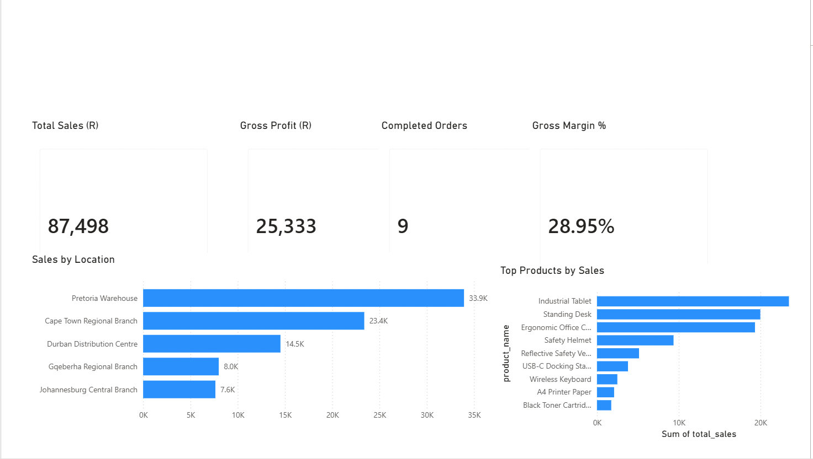
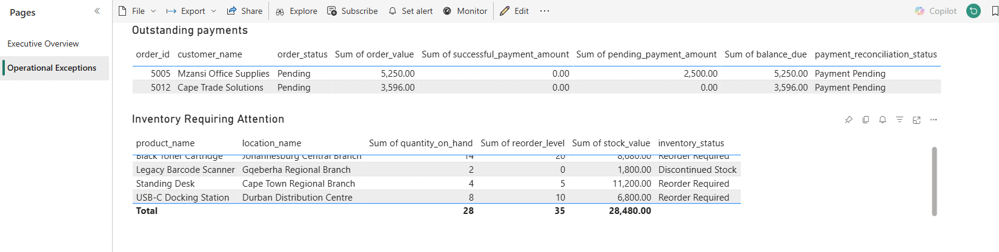

# Microsoft Fabric Enterprise Lakehouse

## Project Overview

This project demonstrates an end-to-end Microsoft Fabric data engineering solution.

The solution ingests multiple business datasets into a Microsoft Fabric Lakehouse in OneLake and transforms the data through Bronze, Silver and Gold layers using PySpark notebooks.

The curated Gold layer is queried through the SQL analytics endpoint and exposed through a semantic model and Power BI report. Data-quality checks and Fabric monitoring provide validation and operational visibility.
## Dashboard Preview

### Executive Overview

The executive dashboard provides a high-level view of sales performance, including total sales, gross profit, completed orders, gross margin, sales by location and top-performing products.

### Operational Exceptions

The operational dashboard highlights items requiring attention, including outstanding customer payments and inventory requiring replenishment.

## Business Scenario

A fictional organisation receives data from several operational systems, including:

- Customers
- Products
- Sales orders
- Inventory
- Suppliers
- Payments
- Business locations

Management needs one reliable platform for operational reporting, customer analysis, inventory monitoring and executive dashboards.

## Solution Architecture

1. Source CSV datasets
2. Microsoft Fabric Lakehouse
3. OneLake storage
4. Bronze ingestion using PySpark
5. Silver cleansing and transformation using PySpark
6. Gold business-ready Delta tables
7. SQL analytics endpoint
8. Power BI semantic model and report
9. Data-quality validation
10. Fabric Monitoring hub
11. GitHub documentation and version control

## Technologies

- Microsoft Fabric
- OneLake
- Fabric Lakehouse
- Apache Spark / PySpark
- Delta Lake
- SQL
- Power BI
- Git
- GitHub
## Project Files
### PySpark Notebooks

- [Bronze Ingestion](notebooks/nb_bronze_ingestion.py)
- [Silver Transformations](notebooks/nb_silver_transformations.py)
- [Gold Business Models](notebooks/nb_gold_business_models.py)
- [Data Quality Checks](notebooks/nb_data_quality_checks.py)

### SQL Analytics

- [Gold Analytics Queries](sql/gold_analytics_queries.sql)

### Documentation

- [Architecture](docs/architecture.md)
- [Source Data Design](docs/source-data-design.md)
- [Monitoring and Operational Validation](docs/monitoring.md)
## Key Results

- **9** completed orders analysed
- **R87,498** total sales
- **R25,333** gross profit
- **28.95%** gross margin
- **117** units sold
- **6** Gold analytical tables created
- **9** automated data-quality checks completed successfully
- Power BI reporting created for executive performance and operational exceptions

## Implementation Checklist

- [x] Create the GitHub repository
- [x] Define the business scenario
- [x] Design the source datasets
- [x] Create the architecture diagram
- [x] Build the Bronze layer
- [x] Build the Silver layer
- [x] Build the Gold layer
- [x] Develop SQL analytics queries
- [x]  Create the Power BI dashboard
- [x] Add data-quality checks
- [x] Add monitoring and documentation

## Project Status

✅ **Completed**

This project demonstrates a complete end-to-end Microsoft Fabric data engineering solution, including raw-data ingestion, Bronze, Silver and Gold Lakehouse layers, data-quality validation, SQL analytics, Power BI reporting, monitoring and technical documentation.
## Author

**Takudzwa Lesley Mhandire**
