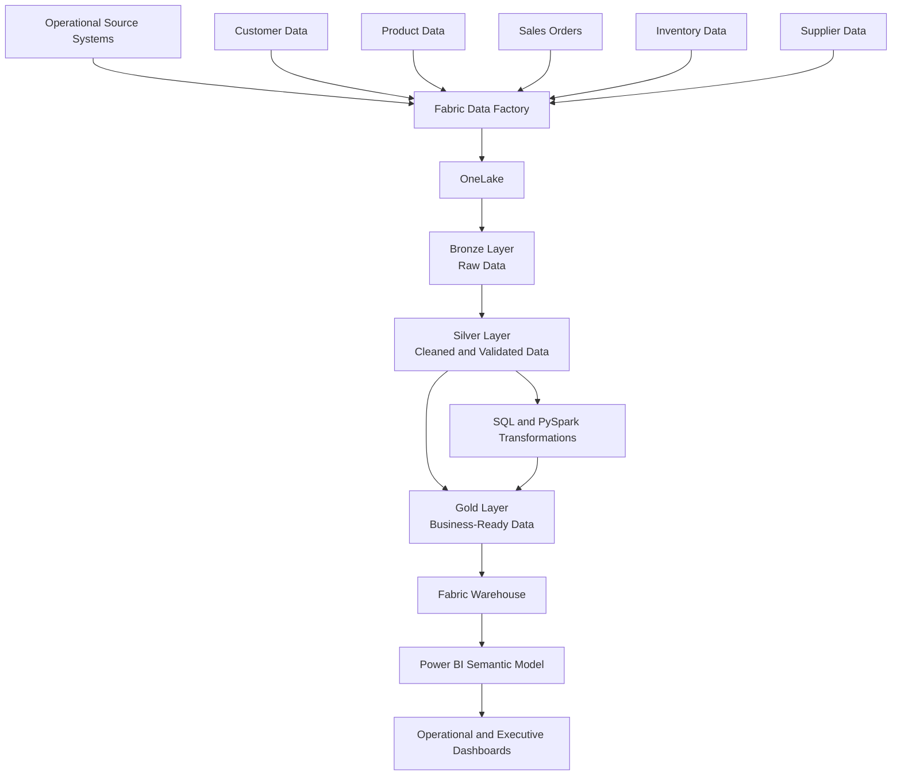

# Solution Architecture

## Overview

This solution demonstrates an end-to-end enterprise analytics platform built using Microsoft Fabric.

Data is ingested from multiple operational source systems, stored in OneLake, transformed through Bronze, Silver and Gold layers, and prepared for reporting through a Fabric Warehouse and Power BI.

## Architecture Diagram

## Architecture Components

### 1. Source Systems

The project uses fictional operational datasets representing:

- Customers
- Products
- Sales orders
- Sales-order lines
- Inventory
- Suppliers
- Business locations

### 2. Fabric Data Factory

Fabric Data Factory pipelines will ingest data from the source files and load it into the Microsoft Fabric environment.

### 3. OneLake

OneLake will provide centralised storage for the organisation's analytical data.

### 4. Bronze Layer

The Bronze layer will contain raw source data with minimal modification.

Its purpose is to preserve the original source records for traceability and reprocessing.

### 5. Silver Layer

The Silver layer will contain cleaned and validated data.

Transformations will include:

- Removing duplicate records
- Handling missing values
- Correcting data types
- Validating relationships
- Standardising names and formats
- Identifying invalid transactions

### 6. Gold Layer

The Gold layer will contain business-ready datasets designed for analytics and reporting.

Examples include:

- Daily sales summaries
- Customer performance
- Product performance
- Inventory status
- Supplier analysis
- Location performance

### 7. Fabric Warehouse

The Fabric Warehouse will provide structured analytical tables for SQL reporting and business intelligence.

### 8. Power BI

Power BI will consume the trusted Gold-layer and Warehouse data to create operational and executive dashboards.

## Data Flow

1. Data is generated by operational systems.
2. Fabric Data Factory ingests the source data.
3. Raw records are stored in the Bronze layer.
4. SQL and PySpark transformations clean the records.
5. Validated records are stored in the Silver layer.
6. Business calculations create Gold-layer datasets.
7. Gold data is loaded into the Fabric Warehouse.
8. Power BI displays trusted business information.

## Future Enhancements

Future versions of this project may include:

- Incremental data loading
- Pipeline monitoring
- Data-quality alerts
- Slowly changing dimensions
- Role-based access control
- Deployment pipelines
- CI/CD
- Real-time data ingestion
- Data governance and lineage
